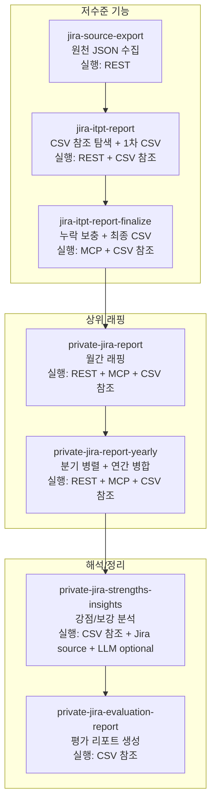

# Private Jira Report Yearly 스킬 가이드 (v1)

## 목적
연간 개인 리포트를 분기 단위 병렬 처리(Q1~Q4)로 생성하고, 각 분기 내부는 주차 병렬 export를 유지하면서 최종 연간 CSV로 취합하는 표준 실행 흐름을 제공합니다.

## 대상
- 1년치 Jira 리포트를 빠르게 생성해야 하는 개인
- 분기별/연간 결과를 한 번에 확인하고 싶은 개인

## 빠른 시작
### 1) 설치
#### skill-installer 사용
```bash
python3 ~/.codex/skills/.system/skill-installer/scripts/install-skill-from-github.py \
  --method git --ref master \
  --url https://github.com/TODOTODoTOdoTodotodo/private-jira-report-skills \
  --path skills/private-jira-report \
         skills/private-jira-report-yearly \
         skills/private-jira-evaluation-report \
         skills/private-jira-strengths-insights \
         skills/private-jira-interview-script \
         skills/jira-itpt-report \
         skills/jira-itpt-report-finalize \
         skills/jira-source-export \
         skills/atlassian-mcp-connect
```

#### 수동 설치
```bash
git clone https://github.com/TODOTODoTOdoTodotodo/private-jira-report-skills.git
rsync -a private-jira-report-skills/skills/ ~/.codex/skills/
```

#### 업데이트
```bash
cd private-jira-report-skills
git pull
rsync -a skills/ ~/.codex/skills/
chmod +x ~/.codex/skills/private-jira-report-yearly/scripts/private-jira-report-yearly.sh
```

### 2) jira_env 준비
템플릿: `~/.codex/jira_env_template`

예시:
```
JIRA_BASE_URL=https://your-domain.atlassian.net
JIRA_EMAIL=your-email@example.com
JIRA_API_TOKEN=ATATT...
JIRA_ACCOUNT_ID=your-account-id
```

### Jira API Token 발급
아틀라시안 계정 > 보안에서 발급


### Jira Account ID 조회
```bash
curl -sS -u "JIRA_EMAIL:JIRA_API_TOKEN" \
  -H "Accept: application/json" \
  "JIRA_BASE_URL/rest/api/3/myself"
```

### MCP 자동 설정
- `private-jira-report`가 `~/.atlassian-mcp.json`을 자동 생성하고 `atlassian-local` MCP를 등록합니다.
- `jira_env`만 준비되어 있으면 별도 MCP 설정 없이 실행됩니다.

### AGENTS.md 설정 옵션
- Codex는 `AGENTS.md`에 정의된 안전/범위 규칙을 준수합니다.
- 전역 규칙은 `~/.codex/AGENTS.md`에 두고, 필요 시 프로젝트 루트에 `AGENTS.md`를 추가해 덮어쓸 수 있습니다.
- 본 레포의 가이드는 `~/.codex/AGENTS.md`의 정책을 기준으로 작성되었습니다.

### 3) 기본 실행 (권장)
```bash
YEAR=2025 PROJECTS=MGTT,ITPT \
EXPORT_START=2024/06/01 EXPORT_END=2026/01/01 \
MATCH_MODE=assignee PARALLEL_RANGES=4 QUARTER_PARALLEL=4 \
ENV_FILE=~/.codex/jira_env \
~/.codex/skills/private-jira-report-yearly/scripts/private-jira-report-yearly.sh
```

CSV seed 사용 (Jira UI CSV export 기반):
```bash
YEAR=2025 PROJECTS=MGTT,ITPT \
EXPORT_START=2024/06/01 EXPORT_END=2026/01/01 \
MATCH_MODE=assignee PARALLEL_RANGES=4 QUARTER_PARALLEL=4 \
ENV_FILE=~/.codex/jira_env \
CSV_SEED=/path/to/jira.csv \
~/.codex/skills/private-jira-report-yearly/scripts/private-jira-report-yearly.sh
```

CSV seed 자동 생성:
```bash
YEAR=2025 PROJECTS=MGTT,ITPT \
EXPORT_START=2024/06/01 EXPORT_END=2026/01/01 \
MATCH_MODE=assignee PARALLEL_RANGES=4 QUARTER_PARALLEL=4 \
ENV_FILE=~/.codex/jira_env \
CSV_SEED_AUTO=1 \
CSV_SEED_JQL='project in (MGTT, ITPT) AND assignee = currentUser()' \
~/.codex/skills/private-jira-report-yearly/scripts/private-jira-report-yearly.sh
```

## 암묵적 호출 방법
- 예시: "2025년 개인 리포트 만들어줘"
- 예시: "작년 리포트 만들어줘. 프로젝트 MGTT,ITPT"
- 예시: "2025년 1분기 리포트 만들어줘" (분기 범위 자동 분할)
- 예시: "2025년 1분기 리포트 만들어줘. 개발자 기준"
- 예시: "2025년 리포트 만들어줘. export 범위 2024/06/01~2026/01/01"
- 예시: "2025년 리포트 만들어줘. assignee WAS currentUser()로 CSV 시드 생성"
- 필요 정보: YEAR, 프로젝트(MGTT/ITPT), role/dev 기준

### 조건 전달 예시(암묵적)
- 역할: "개발자 기준"(ROLE_MODE=dev) / "기획/QA 기준"(ROLE_MODE=plan_qa)
- 분기 선택: "Q1만", "Q1,Q2만"
- 기간 지정: "export 범위 2024/06/01~2026/01/01"
- CSV 시드 JQL: "CSV 시드 JQL은 assignee WAS currentUser()"

### 역할별 예시
- 개발자 기준(merge): "2025년 개인 리포트 만들어줘. 개발자 기준으로."
- 기획/QA 기준(assignee): "2025년 개인 리포트 만들어줘. 기획/QA 기준으로."

## 핵심 동작 요약
1) 연간 범위를 Q1~Q4로 분할해 병렬 실행
2) 분기 내부는 주 단위 export 병렬 처리 유지
3) master 브랜치 PR merge 기간으로 필터링
4) 분기 CSV를 연간 CSV로 병합(중복 root_key 제거)
5) comment match는 기본 OFF, 필요 시 `COMMENT_MATCH=1`로 활성화

### 파라미터 설명 (핵심)
- `YEAR`: 연간 기준 연도
- `PROJECTS`: 대상 프로젝트 (기본 MGTT,ITPT)
- `EXPORT_START/EXPORT_END`: Jira export 범위
- `MATCH_MODE=assignee`: assignee 기준 (currentUser)
- `PARALLEL_RANGES`: 주차 병렬 개수
- `QUARTER_PARALLEL`: 분기 병렬 개수
- `QUARTERS`: 실행할 분기 (예: `Q1`, `Q1,Q2`)
- `ROLE_MODE`: `dev`(기본, PR merge 기준) / `plan_qa`(assignee 기준)
- `DEVSTATUS_CACHE`: dev-status 캐시 경로 (기본: `OUTPUT_DIR/devstatus-cache.json`)
- `CSV_SEED`: Jira UI CSV export 경로 (assignee=currentUser)
  - dev 모드에서는 `사용자정의 필드 (development)`의 `lastUpdated`를 PR merge 기준으로 사용
- `CSV_SEED_AUTO`: CSV_SEED 비어있으면 Jira CSV 자동 생성 (기본 1, 연간 실행 시 1회 생성/재사용)
- `CSV_SEED_JQL`: CSV export JQL override (예: `assignee WAS currentUser()` 포함)
- `DEVELOPMENT_FIELD_ID`: Jira 개발 필드 ID (미지정 시 name 검색)
- `OUTPUT_TIMESTAMP`: 결과 CSV/평가 보고서 타임스탬프 사본 생성 (기본 1)

## 출력 위치
- 기본: `~/Downloads/itpt-YYYY`

생성 파일:
- 분기별: `Q1/itpt-links.csv`, `Q2/itpt-links.csv`, `Q3/itpt-links.csv`, `Q4/itpt-links.csv`
- 연간 취합: `itpt-links.csv`
- 평가 리포트: `evaluation-YYYY.md`

## 누락 키 처리(필수 케이스)
분기 결과에 `missing-keys.txt`가 있으면 분기별로 마무리합니다.

```bash
OUTPUT_DIR=~/Downloads/itpt-YYYY/Q1 \
~/.codex/skills/jira-itpt-report-finalize/scripts/jira-itpt-finalize.sh
```

## 동작 흐름 (요약)
- 입력: YEAR, PROJECTS, EXPORT 범위, MATCH_MODE
- MCP 설정 및 등록
- 분기 병렬 실행 + 주차 병렬 export
- 분기별 itpt-links.csv 생성
- 연간 itpt-links.csv 취합

## 자주 발생하는 문제
1) `ENV_FILE` 없음
- 메시지: `Missing ENV_FILE`
- 해결: `~/.codex/jira_env_template`를 복사해 `~/.codex/jira_env` 생성

2) MCP 초기화 실패
- 메시지 예: `Missing required configuration: domain, email, apiToken`
- 해결: `jira_env` 값 확인 후 재실행

3) 분기별 `missing-keys.txt` 존재
- 원인: MCP 보충 미실행
- 해결: 분기별 `jira-itpt-report-finalize.sh` 실행

## 관련 스킬/스크립트
- 스킬: `private-jira-report-yearly`
- 기반 스킬: `private-jira-report`
- MCP 등록: `atlassian-mcp-connect`
- 리포트 생성: `jira-itpt-report`
- 마무리: `jira-itpt-report-finalize`

## 스킬별 실행 방식
- `private-jira-report-yearly`: REST + MCP + CSV 참조
- `private-jira-report`: REST + MCP + CSV 참조
- `private-jira-evaluation-report`: CSV 참조
- `private-jira-interview-script`: CSV 참조
- `private-jira-strengths-insights`: CSV 참조 + Jira source
- `jira-itpt-report`: REST + CSV 참조
- `jira-itpt-report-finalize`: MCP + CSV 참조
- `jira-source-export`: REST
- `atlassian-mcp-connect`: MCP 등록

## 스킬별 한글 가이드
- [private-jira-report-yearly](skills/private-jira-report-yearly/README.md)
- [private-jira-report](skills/private-jira-report/README.md)
- [private-jira-evaluation-report](skills/private-jira-evaluation-report/README.md)
- [private-jira-interview-script](skills/private-jira-interview-script/README.md)
- [private-jira-strengths-insights](skills/private-jira-strengths-insights/SKILL.md)
- [jira-itpt-report](skills/jira-itpt-report/README.md)
- [jira-itpt-report-finalize](skills/jira-itpt-report-finalize/README.md)
- [jira-source-export](skills/jira-source-export/README.md)
- [atlassian-mcp-connect](skills/atlassian-mcp-connect/README.md)

## 참고

